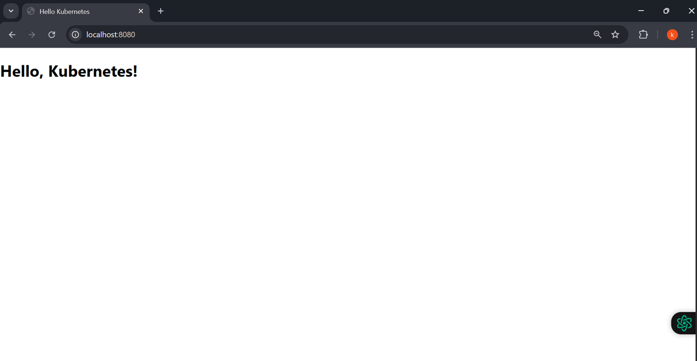
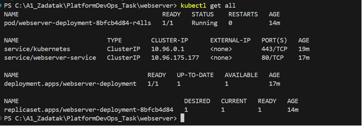

# SPA i Webserver projekt

Projekt je sastavljen od dva dijela: SPA web aplikacija te webserver. Webserver sadrži index.html te halthz.json te Dockerfile i yaml fileove za deployment. SPA aplikacija razvijena je koristeći React framework te dohvaća proizvoda sa vanjog API-ja https://dummyjson.com/products te korisniku prikazuje 10 random proizvoda. Random shuffle ostvaren je korištenjem Fisher–Yates algoritma.

## Authors

- [@KarloKalamiza](https://github.com/KarloKalamiza/A1_Zadatak)

## Deployment

Preduvijeti da bi se uspješno pokrenuo projekt su: instaliran Docker, Kind i Kubectl.

1. Da bi deployali web server pokrenite:

1.1. Navigirati u folder projekta webserver te buildati docker image

```bash
  cd webserver
  docker build -t webserver:latest .
```

1.2. Pokrenuti novi docker kontejner iz prethodno definirane slike

```bash
docker run -d -p 8080:80 webserver:latest
```

1.3. Kreirati kind kluster

```bash
kind create cluster --name my-cluster
```

1.4. Učitati docker image u kreirani kluster

```bash
kind load docker-image webserver:latest --name my-cluster
```

1.5. Deployati yaml fileove u Kubernates

```bash
kubectl apply -f webserver-service.yaml
```

```bash
kubectl apply -f webserver-deployment.yaml
```

1.6. Uvijeriti se da su podovi aktivni

```bash
kubectl get pods
```

1.7. Port forwarding

```bash
kubectl port-forward svc/webserver-service 8080:80
```

1.8. Pokrenuti aplikaciju u pregledniku: http://localhost:8080

2. Da bi deployali SPA aplikaciju pokrenite:

2.1. Navigirati u folder projekta webserver te buildati docker image

```bash
  cd spa-frontend
  docker build -t spa-frontend:latest .
```

2.2. Pokrenuti novi docker kontejner iz prethodno definirane slike

```bash
docker run -d -p 3080:80 spa-frontend:latest
```

2.3. Kreirati kind kluster (ako ste ga kreirali za webserver deployment možete koristiti isti)

```bash
kind create cluster --name my-cluster
```

2.4. Učitati docker image u kreirani kluster

```bash
kind load docker-image spa-frontend:latest --name my-cluster
```

2.5. Deployati yaml fileove u Kubernates

```bash
kubectl apply -f spa-service.yaml
```

```bash
kubectl apply -f spa-deployment.yaml
```

2.6. Uvijeriti se da su podovi aktivni

```bash
kubectl get pods
```

2.7. Port forwarding

```bash
kubectl port-forward svc/spa-service 3080:80
```

2.8. Pokrenuti aplikaciju u pregledniku: http://localhost:3080

## Screenshots







